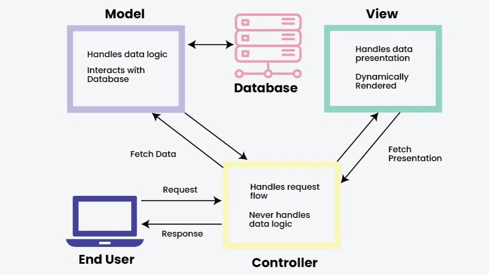
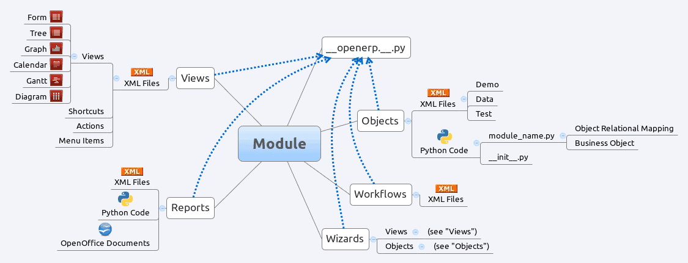
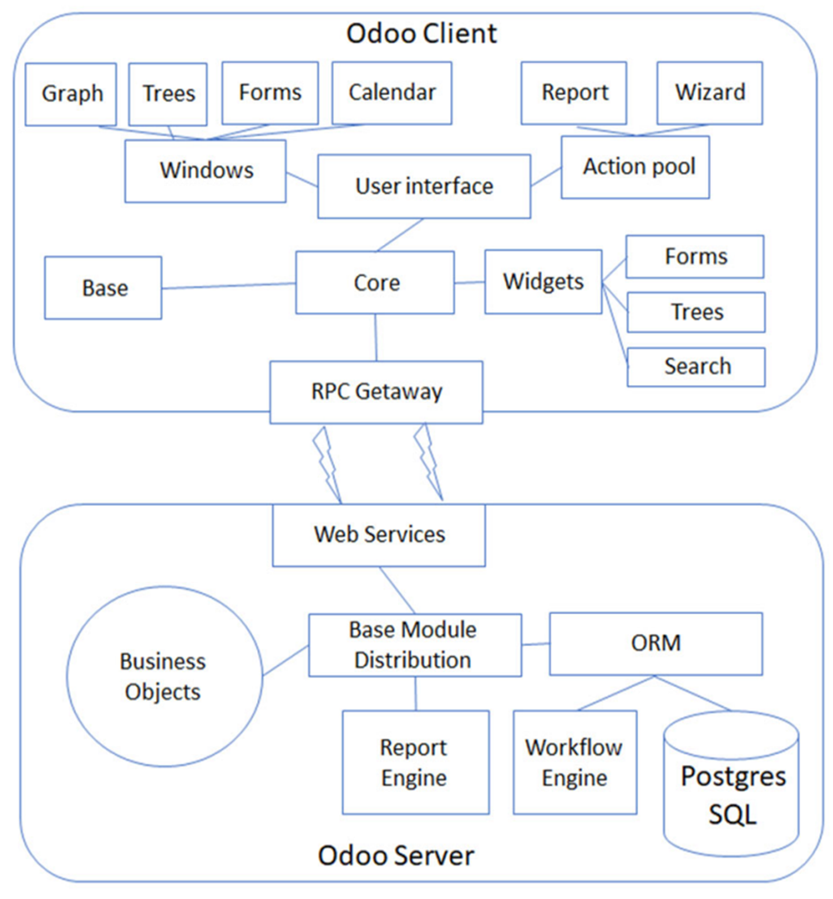

# Odoo Architecture Document

## 📌 Overview of Odoo ERP
Odoo is a comprehensive open-source ERP (Enterprise Resource Planning) system that provides a modular and highly customizable platform for business applications. It is built using a modern tech stack and follows a structured Model-View-Controller (MVC) architecture.

### 🛠️ Tech Stack
- **Backend:** Python (Odoo framework)
- **Database:** PostgreSQL
- **Frontend:** JavaScript, XML, QWeb, OWL (Odoo Web Library)
- **Communication:** JSON-RPC, REST API
- **Hosting & Deployment:** Docker, Kubernetes, On-Premises, Odoo.sh, Cloud (AWS, Azure, GCP)

---
## 🏗️ Odoo Framework & Architecture
### MVC Structure
Odoo follows the MVC architecture, which separates concerns into three primary components:
- **Model:** Handles database interactions via Odoo's ORM (Object-Relational Mapping).
- **View:** Defines UI elements using XML templates and QWeb.
- **Controller:** Manages business logic and connects the model and view.

### Odoo ORM (Object-Relational Mapping)
- Abstracts database interactions
- Supports relational models (one-to-many, many-to-one, many-to-many)
- Automatic migrations and schema updates

---
## 📦 Odoo Modules & Add-ons
Modules in Odoo are independent units that extend the core functionality of the ERP.

### 🔹 Core & Custom Modules
- **Core Modules:** CRM, Sales, Inventory, Accounting, HR, etc.
- **Custom Modules:** Developed to meet specific business needs.

### 🔹 Module Components
- **Models (`models.py`)**: Defines data structures and business logic.
- **Views (`views.xml`)**: Defines UI elements (form, tree, kanban, graph, etc.).
- **Controllers (`controllers.py`)**: Handles user requests.
- **Security (`security.xml`)**: Defines user permissions and access rights.
- **Data (`data.xml`)**: Loads pre-configured data.
- **Reports (`report.xml`)**: Generates reports using QWeb.

---
## 📂 Database & Data Handling
- Uses **PostgreSQL** as the primary database engine.
- Supports complex relational data modeling.
- Provides seamless migration tools for database upgrades.

### 🔹 Database Features
- Multi-company support
- Scheduled actions and cron jobs
- Record history and audit logs

---
## 🔄 Frontend & Backend Communication
- **Web Controllers:** Handle HTTP requests and route them to the appropriate views.
- **API Support:** Supports REST API and JSON-RPC for third-party integrations.
- **Odoo Web Client:** Uses JavaScript and OWL framework for UI rendering.

---
## 🔐 Security & Access Control
Security in Odoo is managed through a combination of record rules and user roles.

### 🔹 Key Security Mechanisms
- **User Roles & Groups:** Role-based access control (RBAC)
- **Record Rules:** Define CRUD permissions at the record level.
- **Field-Level Security:** Restricts access to specific fields.
- **Authentication:** OAuth, Two-Factor Authentication (2FA), LDAP integration.

---
## ⚙️ Workflow & Automation
Odoo provides automation tools to streamline business processes.

### 🔹 Automation Tools
- **Scheduled Actions:** Automates background tasks.
- **Workflows:** Configurable workflows for approvals and state transitions.
- **Email Automation:** Triggers email notifications based on actions.

---
## 🚀 Deployment & Scalability
Odoo can be deployed in various environments to ensure scalability and high availability.

### 🔹 Deployment Options
- **On-Premises:** Self-hosted on local servers.
- **Cloud-Based:** Hosted on AWS, Azure, GCP, or Odoo.sh.
- **Docker & Kubernetes:** Supports containerized deployments for better scalability.

### 🔹 Scalability Strategies
- Load balancing with **Nginx** or **HAProxy**
- Database replication and clustering
- Caching using **Redis** for session storage

---
## 📌 Conclusion
This document provides a structured overview of Odoo’s architecture, covering its MVC framework, module structure, database handling, security, automation, and deployment options. With its modular approach and extensive API support, Odoo remains a flexible ERP solution for businesses of all sizes.
